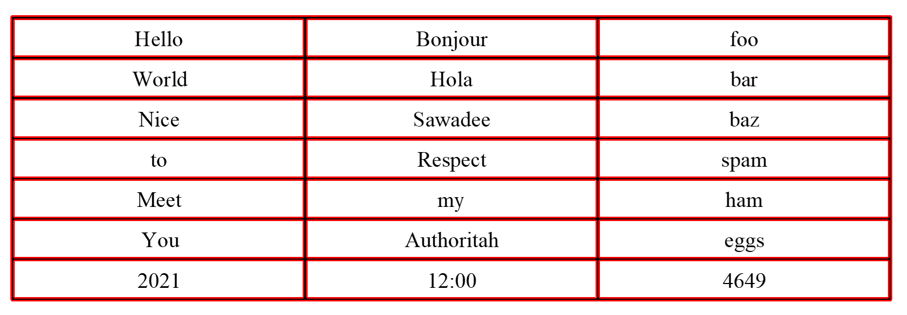

# grit-ocr

**grit_ocr** is OCR tool for grid & table images

Powered by *Tesseract*, recognize contents in grid

* By detecting lines, read grids one by one

* Table lines should be straight & clear

* Screenshot images are super welcomed

* As a disappointment, real images would hardly recognized



## Setup

1. install *[tesseract](https://github.com/tesseract-ocr/tesseract)*

2. create & activate virtualenv

3. install python lib by
    ```
    pip install -r requirements.txt
    ```

## Usage

### Example

```Python
from grit_ocr import *

img_path = "img/sample.png"
min_line_length = 40
row, column = [7, 3]
read_contents = ReadContents(img_path, min_line_length, row, column)
```

* `min_line_length` is minimum length of line to be detected

* `row` & `column` is table size


### Result

```Python
contents = read_contents.read()

>>> contents

array([['Hello' 'Bonjour' 'foo'],
       ['World' 'Hola' 'bar'],
       ['Nice' 'Sawadee' 'baz'],
       ['to' 'Respect' 'spam'],
       ['Meet' 'my' 'ham'],
       ['You' 'Authoritah' 'eggs'],
       ['2021' '12:00' '4649']])
```

* you can get result by `read_contents.read()`, as *numpy array*

* e.g. content of table[2,3] is accessed by `contents[2][3]`

### Test

You can test by

```Python
read_contents.test(test_label_list, check_all_vertices=True, export_img=True)
```

and get below     

```
idx     predict label   is_correct

0       Hello   Hello   o
1       World   World   o
2       Nice    Nice    o
3       to      to      o
4       Meet    Meet    o
5       You     You     o
6       2021    2021    o
7       Bonjour Bonjour o
8       Hola    Hola    o
9       Sawadee Sawadee o
10      Respect Respect o
11      my      my      o
12      Authoritah      Authoritah      o
13      12:00   12:00   o
14      foo     foo     o
15      bar     bar     o
16      baz     baz     o
17      spam    spam    o
18      ham     ham     o
19      eggs    eggs    o
20      4649    4649    o

accuracy: 1.0
```


* `test_label_list` given as *numpy array*, same as *Result* above

* `check_all_vertices` offers a look of all detected vertices

* `export_img` export helpful images, ref *img/*

### Non English OCR

You can derive `ReadContents.read_grid` to recognize other lang

e.g. For Thai

```Python
class ReadContentsDerived(ReadContents):
    def __init__(self, ...):
        ...

    def read_grid(self, grid_img):

        ...

        pil_img = Image.fromarray(grid_img)     ## from np.array (opencv) to PIL.Image
        content = tool.image_to_string(
            pil_img, lang="tha", builder=pyocr.builders.TextBuilder(tesseract_layout=6)
        )

        return content
```